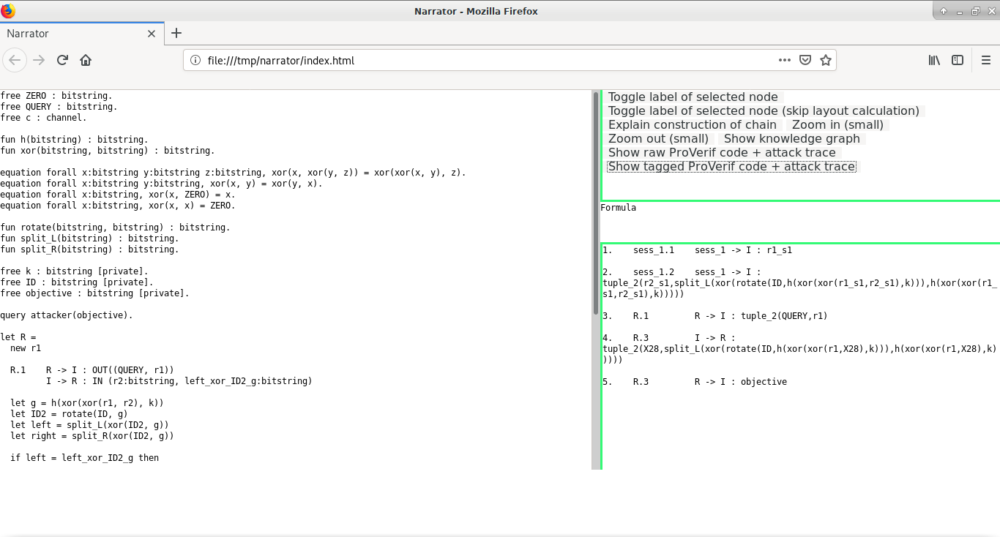
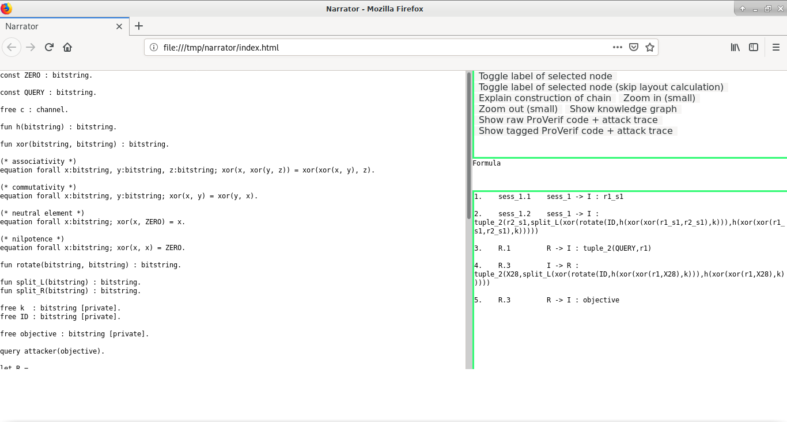
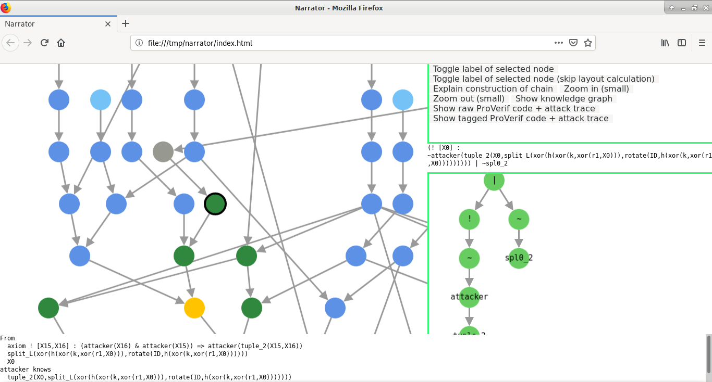
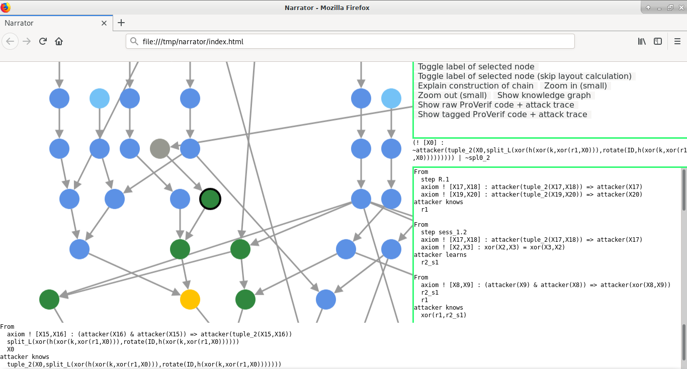

# Narrator interface guide

## Tagged ProVerif + attack trace mode

#### Interface description

The left panel displays the tagged and prettified version of the ProVerif file

Certain information such as types inside processes are hidden, such as `new r1`, where the type of `r1` is not displayed, `in` and `out` constructs are rewritten in the same style as the one used in attack trace with step number tagging

Bottom right panel displays the attack trace

## Raw ProVerif + attack trace mode

#### Interface description

The left panel displays the raw original ProVerif code

Bottom right panel displays the attack trace

## Knowledge graph mode

### Formula submode

#### Classification colour coding

See [here](classification.md)

#### Interface description

The left panel shows the knowledge graph representation of the attack of the protocol

Mid right panel shows the formula of the selected node, the bottom right panel shows the abstract syntax tree of the formula

Bottom panel shows the explanation of the currently selected node

### Explanation submode

#### Interface description

The panels are same as above, but the bottom right panel displays the explanation instead of the formula AST
