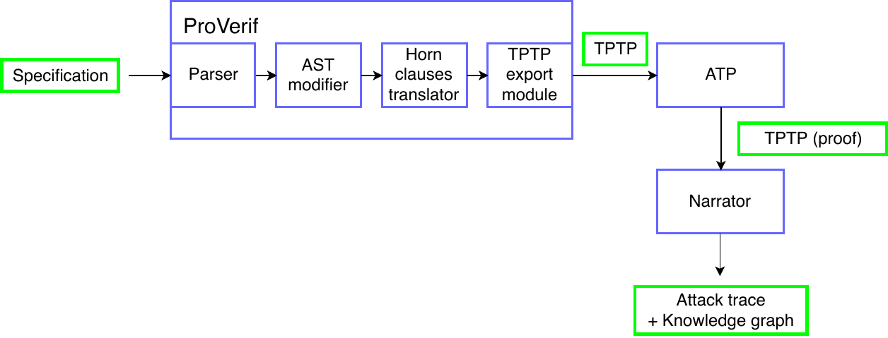

# Pvatp

Pvatp streamlines the usage and passing of data between ProVerif, Vampire and Narrator

## Architecture

The overall architecture is shown below

- The specification file (.pv) is first passed to ProVerif to generate the TPTP output file (.p)

- The TPTP file then passed to an automated theorem prover (ATP) to solve

  - Currently the project uses Vampire for the ATP, but other ATPs can be used as long as TPTP output is supported. Narrator will need to be adjusted however as ATPs may not share the same annotation styles.

- The refutation proof in TPTP format (.solver_log) is passed to the Narrator interface, which is then shown to user
